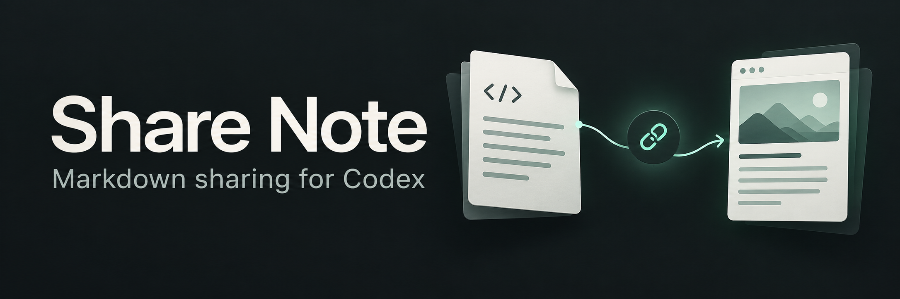

# Share Note



[English](README.md) | [简体中文](README_CN.md)

Share Note is a local Codex plugin that previews, publishes, reads, updates, lists, and deletes Share Note pages through a bundled HTTP client. It does not install or call Obsidian, use Obsidian CLI/URI/vault state, start a resident service, or install dependencies at runtime.

Version 0.1.0 targets Node.js 20+ on Windows, Linux, and macOS. API credentials are stored as plaintext JSON in the user-data directory. Each project's profile binding, publication records, and operation state live in `.openai/share-note.json`; its note fragment keys live in the ignored, private `.openai/share-note.keys.json`. The client does not use a master password, macOS Keychain, or another platform credential manager, and treats the plugin installation as read-only.

## What is delivered

- Standard manifest at `plugins/share-note/.codex-plugin/plugin.json`
- One routing Skill with task-specific references
- Independent TypeScript HTTP client bundled as `share-note.mjs`
- Repo-local marketplace at `.agents/plugins/marketplace.json`
- Locked build dependencies, mock/contract tests, protocol fixtures, and security/acceptance documentation

There is no MCP server, daemon, background sync, dynamic `npm install`, arbitrary webpage execution, or background attachment upload. Local secret storage is intentionally plaintext. New shares use encrypted bodies; an existing themed page can be explicitly updated to public mode with separately uploaded images.

## Install with natural language

Send this prompt to Codex:

```text
Install the Share Note plugin from https://github.com/huangdijia/share-note-for-codex. Read INSTALL.md at the repository root first, then follow it to check prerequisites, install, and verify the result.
```

If this repository is already open in Codex, use:

```text
Install Share Note following this repository's INSTALL.md. Use the current local repository as the plugin marketplace and verify the installation.
```

Codex follows the [installation guide](INSTALL.md) using plugin management commands. This requires a local Codex CLI and Node.js 20+; GitHub installation also requires Git and network access. Installation uses the committed bundle and does not require npm. After installation, start a new conversation and follow the setup flow below to bind your Share Note account.

## Build and test

```bash
npm ci
npm run build
```

`npm run build` type-checks, runs all tests, then emits the Node.js bundle into the plugin installation tree. Users installing the built plugin do not run npm.

## Install from this local marketplace

From the repository root:

```bash
codex plugin marketplace add "$(pwd)"
codex plugin add share-note@personal
```

Start a new Codex conversation after install so the Skill is discovered. The repository marketplace is intentionally merged as one `AVAILABLE` / `ON_INSTALL` Productivity entry pointing to `./plugins/share-note`.

## First setup

In Codex, you can start with “publish README.md”. The agent checks the current project binding, validates an existing binding with an empty `check-files` request, or guides you through first-time setup. Before browser authorization, it explains the target service, private plaintext key storage, and token visibility in AI-assisted mode; previously approved choices are not asked again. In the in-app browser, you complete the page's human verification while the agent attempts to read the clearly labelled API key and finish validation and binding. If the page cannot be read, use hidden local terminal input.

Successful binding resumes the original publication request with style selection, preview, and publication. You do not need to repeat the request, and the just-completed authentication check is not repeated. Setup-only requests never upload a document. Network errors during credential validation or ambiguous HTTP 403 responses do not establish that the API key is invalid; reuse pending authorization only while it still exists and has not expired. System browser launch failures clear the new session, so prepare again after fixing the launch issue. Rejected, missing, or unreadable saved credentials stop for repair without automatically creating a replacement identity. These checks and continuation are orchestrated by the Codex Skill; direct CLI publication interfaces are unchanged.

Run this command in an interactive terminal from the project you want to bind:

```bash
node /absolute/path/to/share-note.mjs setup-browser
```

This shortcut uses the public service and the `public` profile, with the current directory as the project root. For a new profile, that directory becomes its allowed source root. Existing profile source restrictions are preserved.

The command automatically reuses a matching, valid credential or opens the system browser for a new authorization. Complete the normal human verification, then paste the displayed API key into the terminal once (input is hidden). It verifies authentication using an empty `check-files` request **before saving**, then binds the project. There is no separate completion, doctor or project-configuration command. Incorrect keys are not saved; the interactive command allows up to three attempts using the same authorization page.

For explicit project/profile selection, use one non-secret request:

```json
{
  "profile": "public",
  "service": "public",
  "projectRoot": "/absolute/path/to/project",
  "allowedSourceRoots": ["/absolute/path/to/project/docs"]
}
```

```bash
node /absolute/path/to/share-note.mjs setup-browser --request /absolute/path/to/browser-setup.json
```

`allowedSourceRoots` may be omitted: existing profile roots are preserved, otherwise the project root is used. For self-hosting, add `projectRoot` to the explicitly confirmed self-hosted request below and call `setup-browser` with it.

Rerun the same command after an interruption to resume an unexpired matching pending setup without reopening the browser. A successful rerun validates and reuses the saved credential without prompting. Network errors, a changed source configuration, a corrupt configuration, or a project bound to another profile stop the flow. An existing rejected credential is never silently replaced with a new identity. If local project binding fails after the credential was saved, rerun the command to reuse that credential and finish binding. An already installed plugin must be refreshed from this checkout to use the new bundle.

## Codex in-app browser binding

For AI-assisted binding in Codex, use the bundled Skill's [setup workflow](plugins/share-note/skills/share-note/references/setup.md). The agent calls:

```sh
node /absolute/path/to/share-note.mjs setup-codex-browser --request /absolute/path/to/browser-setup.json
```

The request uses the same `profile`, `service`, `projectRoot`, optional roots and confirmed self-hosted origins as `setup-browser`. The no-request shortcut uses the current directory and public profile. An existing valid credential is verified and bound immediately. Otherwise, the command returns `awaiting_user`, the exact `authorizationUrl`, `sessionId`, origins, and expiry without opening a system browser. The agent opens that URL in the Codex in-app browser, lets you complete human verification, and reads the displayed API key.

The agent adds `sessionId` to a copy of the original request and calls `setup-codex-browser-complete`, supplying the key in the child process environment `SHARE_NOTE_BROWSER_API_KEY`. For tools without a structured environment argument, append `--key-tty` and supply the token to the dedicated PTY only after the hidden-input prompt appears. Without that flag, no terminal prompt is used. Completion checks the pending session and canonical project root, authenticates with empty `check-files`, saves, binds the project, and consumes pending state. Missing/expired/replaced sessions fail without generating another identity; a bad key remains unsaved and can be retried with the same session. Rerunning prepare validates/reuses an already saved credential, including after a local binding failure.

**Exposure:** in this explicitly selected mode, the authorization URL/UID and page token can enter agent tool/session context. The token never belongs in request files, shell arguments, CLI output, or assistant replies. Use a structured child-process environment, not shell interpolation. Keep manual `setup-browser` when you want hidden local input. If a browser tool or readable page token is unavailable, use the manual fallback described in the Skill. Live public-service page compatibility has not been verified by the mock tests.

### Two-step setup and recovery

The original two-step commands remain available. They keep the generated UID, authorization URL, browser page, and API key out of request files and ordinary output.

First create a non-secret request for the public service, then start browser setup:

```json
{
  "profile": "public",
  "service": "public",
  "allowedSourceRoots": ["/absolute/path/to/project/docs"]
}
```

```bash
node /absolute/path/to/share-note.mjs setup-browser-start --request /absolute/path/to/public-browser-start.json
```

The client creates a cryptographically random UID in its private, short-lived pending state and opens the exact `https://api.note.sx/v1/account/get-key` authorization route in the system default browser. Complete the service's normal human verification there. The client does not inspect browser DOM, browser logs, redirects, or the clipboard, and does not register an Obsidian URI handler.

Then use a second request containing only the profile:

```json
{ "profile": "public" }
```

```bash
node /absolute/path/to/share-note.mjs setup-browser-complete --request /absolute/path/to/browser-complete.json
```

`setup-browser-complete` prompts in the local TTY for the displayed API key without echoing it. The key does not enter the request file, arguments, JSON result, logs, or persisted profile; after a successful authentication check it is deliberately written as plaintext to a private `0600` file in the user-data directory. To abandon a pending setup, use `{ "profile": "public", "cancel": true }`; this deletes it without prompting.

For a self-hosted instance, the user must deliberately type and confirm both origins independently. They may be equal, but neither is inferred or substituted:

```json
{
  "profile": "work",
  "service": "self-hosted",
  "apiBaseUrl": "https://api.notes.example",
  "webBaseUrl": "https://share.notes.example",
  "confirmedApiOrigin": "https://api.notes.example",
  "confirmedWebOrigin": "https://share.notes.example",
  "allowedSourceRoots": ["/absolute/path/to/project/docs"]
}
```

The confirmation fields must exactly equal the normalized origins. A browser launch is bound to that API origin; a failed launch, wrong key, doctor failure, or unsupported platform never switches to the public service. Pending setup expires after ten minutes (configurable only from 60 to 1,800 seconds) and is removed when it is completed, cancelled, or next accessed after expiry.

The existing `setup` action remains available to import a credential already obtained through a legitimate flow. Its request still contains only non-secret paths and the name of a process-scoped credential environment variable; do not put a UID or API key in a request file.

After a legacy credential import, run doctor with a small JSON request containing only the profile. Browser completion already performs this check before saving. Doctor sends an authenticated empty `check-files` request and never creates a note.

## Configure a project

After the user-level profile exists, bind it to the exact project root before any document action:

```json
{
  "projectRoot": "/absolute/path/to/project",
  "profile": "public"
}
```

```bash
node /absolute/path/to/share-note.mjs configure-project --request /absolute/path/to/configure-project.json
```

This creates the commit-safe `.openai/share-note.json` manifest and ensures `.openai/.gitignore` excludes `share-note.keys.json`. The manifest may select only an existing user-level profile; it cannot add service origins, credential sources, or allowed source roots. An empty project can be rebound to another profile, but a binding with any publication record or operation is immutable.

To copy matching records from the legacy user-level registry without deleting the originals, set `"importLegacyRecords": true`. Only records with the same profile and a source inside this project are imported. Missing keys or ID conflicts fail the import before any remote request.

## Actions

Request-file invocations have this shape (`setup-browser` also supports the no-request shortcut above):

```bash
node /absolute/path/to/share-note.mjs <action> --request /absolute/path/to/request.json
```

Supported actions are `setup-codex-browser`, `setup-codex-browser-complete`, `setup`, `setup-browser`, `setup-browser-start`, `setup-browser-complete`, `doctor`, `configure-project`, `capabilities`, `themes`, `preview`, `publish`, `read`, `link`, `update`, `list`, and `delete`. Request files contain paths, record IDs, hashes, session IDs, service origins, and explicit write authorization—not secrets, browser-returned keys, or note bodies.

No master-password environment variable is required. Legacy setup and doctor remain profile-scoped; `setup-browser` also binds the requested project. Every document action (`preview`, `publish`, `read`, `link`, `update`, `list`, and `delete`) requires an absolute `projectRoot`; the profile is loaded from that project's manifest. These actions reject the legacy top-level `profile` and `workspaceRoot` fields, and source paths must be relative to `projectRoot`.

Preview returns the resolved profile, API/Web origins, and `projectBindingHash`. Publish and update authorization must echo that profile and binding hash together with the exact content hash. This invalidates authorization if the project target changes after preview.

Publishing and updating always require a fresh preview and exact hash-bound authorization. New shares use encrypted publication. Existing themed pages additionally support explicitly authorized public updates with separate image uploads; this does not change the profile default. The client stores the project note key and pending operation before the first create request, never blindly retries ambiguous writes, and reports one of `verified`, `submitted_unverified`, `unknown`, `failed`, `blocked`, or `already_absent`.

`list` has `scope: "project"` and never claims to enumerate the remote account. Delete keeps the local source, project audit record, and project key. Local PNG, JPEG, GIF and WebP images referenced with Markdown image syntax are embedded as data URIs inside encrypted page bodies by default. For explicitly authorized public updates, they are uploaded separately and referenced by their returned URLs. Image paths are resolved relative to the source document and must stay inside the project and configured allowed roots, including symlink targets. The source and image bytes share the configured source-size limit; repeated image references count once per occurrence. Publication and updates reject images changed after preview. Remote image URLs, SVG, raw HTML image embeds and active embeds remain blocked.

To convert an existing themed share, ask Codex: “Update README_CN.md in public mode with separately uploaded images.” Preview uses `encryption: "public"` and `imageMode: "upload"`; the update authorization must match both fields as well as the preview hash and target record. Public pages and their image URLs are readable without a fragment key. Subsequent updates preserve the record's mode unless explicitly changed. Uploaded images may remain after a note is deleted; the upstream deletion endpoint does not delete image attachments.

Run `node /absolute/path/to/share-note.mjs capabilities` before relying on a new feature. This offline command reports the running client's protocol, preview schema, themes, actions and supported mode combinations; it does not test the server or require credentials. A stale installed bundle can differ from the repository even when their version labels match.

Preview also reports image counts, bytes, mode and visibility. Updates that verify unchanged content return `unchanged: true` and `noteWriteSubmitted: false` instead of rewriting the note. Project lists retain history but expose `active`, `encrypted` and `deletedAt` for target selection, plus `unresolvedOperations` for pending/unknown work. An active local record is not a fresh remote availability check.

To retrieve an existing URL without publication, call `link` with `projectRoot` and the exact `recordId`. Public URLs omit fragments; encrypted URLs include the stored decryption key. This reads only the local registry/key store, does not contact the server, and rejects deleted records. See the [image workflow retrospective](docs/experiments/image-workflow-retrospective.md) for the decisions behind these safeguards.

## Article styles

Run `node /absolute/path/to/share-note.mjs themes` to list the built-in styles without a project or credentials:

| ID | Name | Purpose |
| --- | --- | --- |
| `simple` | 简洁 | System default: white background, system sans-serif and blue links |
| `technical` | 技术 | Wider article with stronger code and table treatment |
| `reading` | 阅读 | Warm background, system serif, narrower measure and generous line spacing |
| `dark` | 深色 | Dark article area with light text; the service's outer interface is unchanged |
| `github` | GitHub | GitHub light Markdown layout for technical documents |
| `typora-github` | Typora GitHub | White Typora-inspired layout with generous spacing and heading rules |
| `typora-newsprint` | Typora Newsprint | Warm paper, serif type and newspaper-inspired layout |
| `typora-night` | Typora Night | Blue-gray article area with soft light text |
| `obsidian` | Obsidian | Compact light reading column with purple accents |
| `obsidian-dark` | Obsidian 深色 | Dark gray reading column with purple accents |

Set `"defaultTheme": "technical"` through `configure-project` for a project default. On an already configured project, omit `profile` to preserve its binding. This changes the default for new previews only and preserves records and operations. Existing projects without this field use `simple` for new shares.

Add `"theme": "reading"` to a `preview` request for a one-time override. The result includes `theme` (the actual theme identifier) and `themeName` (display name). A legacy unthemed update preview reports `theme: null`. Publish uses that preview exactly; changing a theme requires a new preview and its new content hash.

For new publications through Codex, the agent asks you to choose from the built-in catalog before creating the preview, recommending the project default (or `simple`). It uses Codex's interactive question tool when available, otherwise a conversation question, and waits for your choice. Say “share with the reading style” or “use the default style” to skip the question. Natural “Typora” and “Obsidian” requests select `typora-github` and `obsidian`; request `typora-night` or `obsidian-dark` explicitly for their dark variants. A one-time choice does not change the project default or authorize an upload. Direct CLI and preview-only requests keep their default behavior; updates preserve the existing style unless you request a change.

For updates, include the target `recordId` in the **preview** request as well as the update request. The source must match that project's record. Without an explicit theme, the preview preserves the record's style, regardless of the current project default. A legacy record without a theme retains its original unthemed body format; explicitly selecting a built-in theme migrates it. Previews created by older clients must be regenerated.

The sanitized body, trusted scoped CSS and article container form the local preview and online payload. Public updates replace preview image data with verified uploaded asset URLs and verify the resulting article after upload. Only the local HTML document shell differs. These are adapted article styles: they do not install, call or integrate with the GitHub, Typora or Obsidian apps, and they do not add syntax support. Themes use local system fonts, with no downloaded fonts, images or external CSS. The `github` style is derived from a pinned `github-markdown-css` source under the MIT license recorded in `THIRD_PARTY_NOTICES.md`; the Typora- and Obsidian-named styles are independent visual adaptations. Long code and wide tables scroll within their own areas. Custom CSS, syntax highlighting and Mermaid are not supported. HTML/Markdown read output remains sanitized and does not reproduce theme CSS.

See `examples/preview-reading.request.json`, `examples/preview-update.request.json`, and `examples/configure-theme.request.json`. Automated mock checks and local screenshots do not establish compatibility with a live service; see `docs/THEME_ACCEPTANCE.md` for the current verification boundary.

## Runtime data

The default user-data directory is:

- Windows: `%APPDATA%\codex-share-note\`
- Linux: `$XDG_DATA_HOME/codex-share-note/`, or `~/.local/share/codex-share-note/`
- macOS: `~/Library/Application Support/codex-share-note/`

Profiles, previews, locks, legacy records, short-lived pending browser setups, and plaintext API credential files live there. Files and directories are created atomically with `0600` and `0700` permissions on POSIX systems; Windows relies on the current user's data-directory ACL because POSIX modes are not available there. `SHARE_NOTE_DATA_DIR` changes the whole user-data location for isolated tests and controlled environments.

Project records and operations are atomically written to `.openai/share-note.json` using project-relative source paths and fragment-free URLs. Per-note keys are plaintext in `.openai/share-note.keys.json`, created as `0600` on POSIX and ignored by the adjacent `.openai/.gitignore`. Git ignore does not protect a key file that was already tracked, and anyone who can read or copy this file can decrypt its shares. Windows relies on the checkout's current-user ACL.

This design provides no encryption at rest: any process or user that can read the user data directory can recover the API credential, and any process or user that can read the project key file can recover its note keys. Existing schema-v1 Keychain and schema-v2 encrypted-vault profiles are not imported or read; rerun setup to create a schema-v3 plaintext-file profile. Old external Keychain entries, encrypted files, and legacy global records are left untouched.

## Protocol and test status

The frozen profile and upstream commits are recorded in `docs/PROTOCOL.md`. Security boundaries are in `docs/SECURITY.md`; A01–A22 results are in `docs/ACCEPTANCE.md`.

Automated tests use the in-process mock service and deterministic protocol fixtures. A live separate-image upload experiment on the public service is documented in [the experiment report](docs/experiments/independent-image-upload.md); that report distinguishes byte-level read-back from browser rendering. No general self-hosted compatibility, clean-machine installation, release or marketplace publication is claimed.
